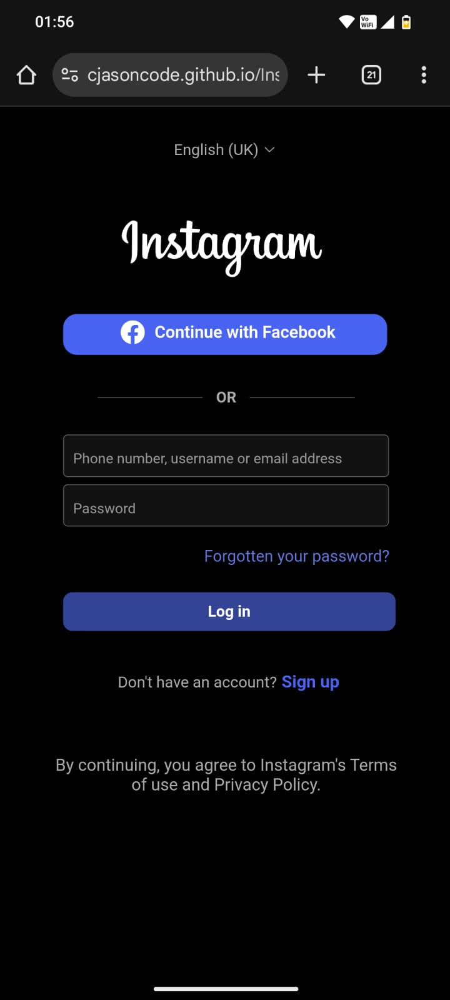

## *SOCIALPICS_LOGIN_UI*  🚀

This repository is created *only for educational purposes*.  
It is a static project made using HTML and CSS, with *no user data collection*.

---

## Disclaimer  

*DISCLAIMER: THIS PAGE WAS MADE AS A PERSONAL EDUCATIONAL PROJECT.* 

This is *NOT* the official site of the company or brand identified on the page.  
The creator of this page is *NOT affiliated* with the company or brand in any way.  
This page is a *personal project made in connection with an educational exercise.*


## 📱 Instagram-Inspired Responsive Login Page

A **responsive and mobile-friendly login page UI**, inspired by Instagram’s design, built using **HTML and CSS only**.  
This project focuses on creating a **clean, modern, and user-centric design** while applying best practices for responsive layouts.

---

## ✅ Features
- **Mobile-First Design**: Optimized for smaller screens first.
- **Responsive Layout**: Fully adaptable to various screen sizes using **CSS Media Queries**.
- **Flexbox Layout**: Simplifies alignment and distribution of elements.
- **Brand-Like Aesthetics**: Inspired by Instagram’s minimalist and modern design.

---

## 🛠️ Technologies Used
- **HTML5** – For semantic and structured markup.
- **CSS3** – For styling, layout, and responsiveness.
  - **Flexbox**
  - **Media Queries**

---

## 📸 Preview  
👉 **Live Demo:** [Click Here](https://cjasoncode.github.io/SocialPics_Login_UI/)  

<p align="center">
  
</p>
 
 

---

## 📂 Project Structure

```
Instagram_clone/
│
├── index.html              
├── style.css               
│
├── LOGO/                    
│   ├── Facebook.png
│   └── instagram.png
│
├── SCREENSHOT/             
│   └── screenshot.jpeg
│
└── README.md                
```

---

## 💡 How It Works
1. **Header Section** – Displays the Instagram-inspired logo.
2. **Login Form** – Includes username/email and password fields with a login button.
3. **Sign Up & Forgot Password Links** – Styled to mimic Instagram’s interface.
4. **Responsive Adjustments** – Media queries ensure proper layout on mobile devices.

---

## 🚀 How to Run Locally
1. Clone the repository:
   ```bash
   git clone https://github.com/cjasoncode/Instagram_clone.git

2. Open the **index.html** file in your browser.


## 📈 Future Improvements

  *   Add JavaScript for form validation.

*    Implement dark mode toggle.

*    Include password visibility toggle.

*    Add animations for a better user experience.

## 📜 License
This project is **for educational purposes only**. It is not affiliated with  Instagram.
